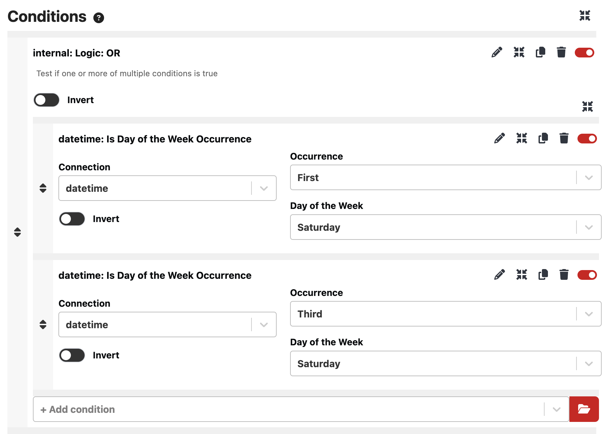
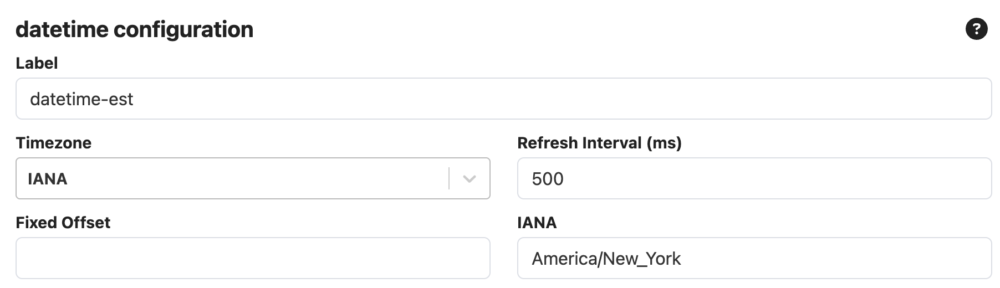
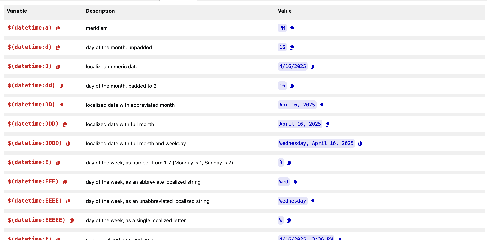

## Generic DateTime module

A generic module for dates & times with timezone support.

This module allows for building complex triggers and conditional actions based on the current date and time by exposing various feedbacks and variables.

Do you have different events that occur on the same day of the week? This module allows you to easily set your triggers to conditionally fire based on what week it is.

Do you run a production that spans across multiple timezones and find it tedious ensuring all of your times are correct? This module also provides configuration options for any valid offset or IANA timezone, allowing you to run multiple instances to handle several timezones at once.

Do you have a need for more specific date & time variables to be used for displaying or in conjunction with other modules? This module is built on the popular date/time library luxon, and exposes all of the defined luxon formats as variables.

